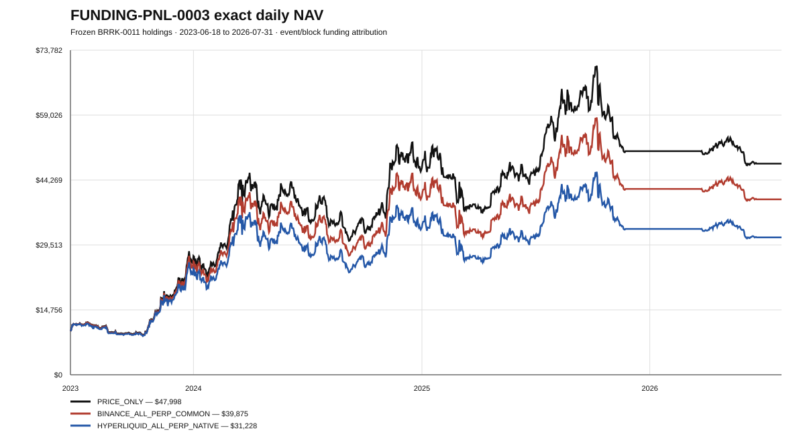
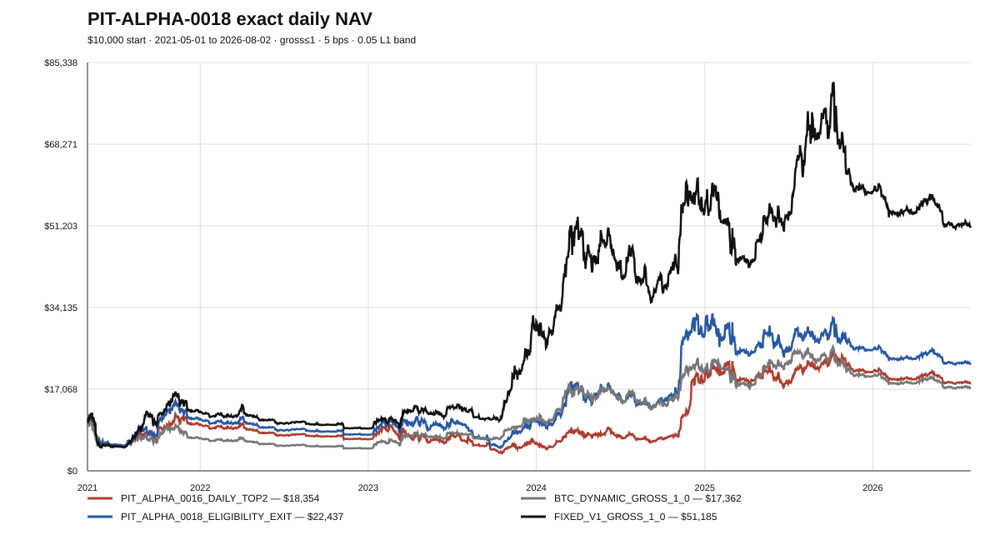

# laugh-to-2028

一个以 **长期生存、可审计、可自动执行和减少回测自欺** 为目标的 crypto systematic-allocation research project。

核心纪律：

1. 机制有效不等于组合可用；
2. 固定赢家币池结果不能直接外推；
3. 先登记、后运行，失败版本必须保留；
4. 归因只能授权一种结构变化，不能授权参数搜索；
5. 研究信号和交易执行必须分层；
6. 价格回测不是可部署 PNL，funding、basis、fees、slippage 和 fills 必须单独验证；
7. 对同一历史窗口不无限救策略。

## Current status

| Layer | Evidence | Decision |
|---|---|---|
| BTC dynamic beta | Frozen core exposure concept | 保留 |
| Fixed-universe V1 | Strong historical result, materially asset-selection-biased | 不直接外推 |
| **BRRK-0011** | **Best frozen canonical alpha/risk target** | **当前研究基线** |
| DISP-0014 / PIT-DISP-0015 | Dispersion contains risk information; fixed-panel result is selection-sensitive | Diagnostic only |
| PIT-ALPHA-0016 / 0018 | Rank and persistence mechanisms work; broad portfolio still has deep MDD and negative 2025+ | Portfolio rejected; alpha line stopped |
| FUNDING-DATA-0001 | Official Binance and Hyperliquid sources validated | Passed |
| FUNDING-CROSSVENUE-0002 | Binance is sign/regime proxy, not Hyperliquid level proxy | Passed with strict source-role limit |
| **FUNDING-PNL-0003** | **Native Hyperliquid all-perp funding materially destroys BRRK PNL** | **All-perp gross≤1 default rejected** |
| Spot/Perp Router | Authorized for deterministic testing; not yet validated | **Next research priority** |
| Hyperliquid executor | Testnet/shadow skeleton | Hardening required |

---

## Canonical price-only BRRK result


The chart uses 1,332 persisted daily equity observations from 2022-12-10 through 2026-08-02, completed UTC information, `t → t+1` execution, 0.05 L1 band and 5 bps per absolute weight change.

| Strategy | Final $10k | CAGR | MDD | Ann vol | Sharpe | Calmar |
|---|---:|---:|---:|---:|---:|---:|
| V1 baseline | $57,116 | 61.26% | -37.64% | 44.45% | 1.295 | 1.628 |
| **BRRK-0011** | **$62,247** | **65.10%** | **-33.72%** | 44.21% | **1.353** | **1.931** |
| BRRK + fixed DISP-0014 | $63,084 | 65.71% | -30.60% | 39.01% | 1.488 | 2.147 |
| BRRK + dynamic PIT-DISP-0015 | $56,543 | 60.81% | -30.40% | 39.69% | 1.393 | 2.000 |

`BRRK-0011` remains the canonical **directional target**, but FUNDING-PNL-0003 proves that the price-only curve is not a full-perp deployment estimate.

Detailed dispersion result: [`research/results/PIT_DISP_0015_RESULT_2026-08-04.md`](research/results/PIT_DISP_0015_RESULT_2026-08-04.md)

---

## Funding-adjusted PNL



Frozen BRRK-0011 held weights were charged event/block funding without changing any target. Positive funding means a long pays.

### Common Binance / Hyperliquid window

2023-06-18 through 2026-07-31:

| Scenario | Final $10k | CAGR | MDD | Sharpe | Calmar |
|---|---:|---:|---:|---:|---:|
| **Price-only** | **$47,998** | **65.37%** | **-33.72%** | **1.355** | **1.939** |
| Binance all-perp common proxy | $39,875 | 55.82% | -34.79% | 1.222 | 1.604 |
| **Hyperliquid native all-perp** | **$31,228** | **44.08%** | **-37.04%** | **1.046** | **1.190** |

Hyperliquid native funding over the common period:

- compounded funding effect: **-34.94%**;
- additive funding contribution: **-42.97%**;
- positive funding paid: **-46.41%**;
- negative funding received: only **+3.43%**;
- BTC contribution: **-25.19%**;
- SOL contribution: **-13.40%**;
- ETH contribution: -3.05%;
- BNB contribution: -1.33%.

Relative to price-only, the native all-perp implementation loses about **$16,770** of ending value and **21.29 percentage points of annual CAGR** in this window.

Relative to Binance on the same blocks, Hyperliquid ends about **$8,647 lower** and CAGR is **11.75 percentage points lower**. Binance therefore cannot be used as a Hyperliquid cost point estimate.

### Full Binance proxy window

2022-12-10 through 2026-07-31:

| Scenario | Final $10k | CAGR | MDD | Sharpe | Calmar |
|---|---:|---:|---:|---:|---:|
| Price-only | $62,247 | 65.29% | -33.72% | 1.354 | 1.937 |
| Binance all-perp proxy/stress | $50,259 | 55.85% | -34.79% | 1.222 | 1.605 |

Binance is retained only as a long-history sign/regime and stress proxy.

**Decision:** gross≤1 long exposure should not default to perpetuals. A spot-first router is now the primary implementation research task. No routing rule has yet been promoted.

Detailed result: [`research/results/FUNDING_PNL_0003_FROZEN_HOLDINGS_2026-08-04.md`](research/results/FUNDING_PNL_0003_FROZEN_HOLDINGS_2026-08-04.md)

Exact outputs: [`research/results/funding_pnl_0003/`](research/results/funding_pnl_0003/)

---

## Dynamic alpha research

### PIT-ALPHA-0016 — ranking works, daily Top-2 fails

On the historical point-in-time Binance USDT universe:

```text
240 consecutive completed daily rows
+ completed-day quote volume >= $25m
+ own trend > 0
+ relative-to-BTC trend > 0
+ rank = (0.5 own + 0.5 relative) / rv30
```

The rank beat **98/100** fixed-random-priority placebos, but daily Top-2 replacement produced CAGR 12.25%, MDD -69.12%, turnover 349.62 and negative 2025+ economics.

### AUDIT-0017 — conversion defect

- 83.41% of turnover came from switching alt names;
- median hold was one day;
- 52.07% of entries remained broadly eligible after 30 days, but only 19.35% remained daily Top-2;
- 30-day median forward return was -2.43%, while mean was +4.83%.

The rank has many small losers and a few persistent winners. Daily Top-2 replacement interrupted the right tail.

### PIT-ALPHA-0018 — entry rank / eligibility exit



0018 used Top-2 only to fill vacancies and retained incumbents until own trend, relative trend, history/liquidity eligibility failed, or BTC became risk-off.

| Strategy | Final $10k | CAGR | MDD | Sharpe | Calmar | Turnover |
|---|---:|---:|---:|---:|---:|---:|
| PIT-ALPHA-0018 | $22,437 | 16.62% | -66.86% | 0.555 | 0.249 | 141.86 |
| PIT-ALPHA-0016 | $18,354 | 12.25% | -69.12% | 0.480 | 0.177 | 349.62 |
| BTC dynamic gross≤1 | $17,362 | 11.07% | -54.31% | 0.461 | 0.204 | 40.44 |
| Fixed V1 gross≤1 | $51,185 | 36.43% | -59.72% | 0.889 | 0.610 | 131.81 |

0018 reduces turnover by about 59.4%, raises median holding from one to three days and still beats 98/100 same-state-machine placebos. But MDD remains -66.86%, 2025 return is -10.03%, 2026 through Aug 2 is -11.06%, and 2025+ CAGR is -13.11%.

**Decision:** ranking and persistence mechanisms are real; broad dynamic-alpha portfolio is rejected. No more threshold tuning is authorized on this window.

Detailed result: [`research/results/PIT_ALPHA_0018_RESULT_2026-08-04.md`](research/results/PIT_ALPHA_0018_RESULT_2026-08-04.md)

---

## Funding source evidence

### FUNDING-DATA-0001

- Binance official monthly USD-M funding archives are complete for BTC, ETH, SOL, BNB and XRP over each contract lifetime through 2026-07;
- early Hyperliquid native funding used approximately 8-hour events;
- current native funding is hourly;
- funding must be accounted event by event, not with a fixed APR shortcut.

### FUNDING-CROSSVENUE-0002

| Asset | Pearson | Spearman | Sign agreement |
|---|---:|---:|---:|
| BTC | 0.646 | 0.553 | 79.69% |
| ETH | 0.612 | 0.623 | 81.53% |
| SOL | 0.673 | 0.641 | 74.00% |
| BNB | 0.612 | 0.616 | **38.23%** |
| XRP | 0.652 | 0.620 | 75.82% |

Preregistered classification: **sign/regime proxy**, not level proxy. No source blending or fitted multiplier is allowed.

---

## Next research queue

### P0 — Spot/Perp Router data and execution audit

Before calculating a routed PNL curve, establish:

1. which BTC/ETH/SOL/BNB/XRP spot representations and direct USDC pairs actually exist on the intended venue;
2. whether each representation is canonical, bridged or wrapped;
3. live spot and perp depth by side and target notional;
4. expected VWAP/slippage for $1k/$10k/$50k/$100k orders;
5. current spot and perp fee treatment;
6. position/accounting compatibility with the executor;
7. exact fallback when spot is unavailable or insufficient.

No spot market is assumed executable merely because a token name resembles the target.

### P1 — Deterministic Spot/Perp Router

The first router must preserve the same directional target:

```text
long exposure within verified spot capacity → spot
required short or excess exposure → perp
perp portion → native funding applies
```

It must include spot/perp fees, basis, spread, slippage, inventory and fallback costs. No PNL-selected funding threshold.

### P2 — Hyperliquid execution hardening

1. metadata-derived size precision;
2. pre/post account and fill reconciliation;
3. partial/resting/rejected/cancelled handling;
4. order slicing / TWAP;
5. persistent idempotency and audit logs;
6. live target-notional L2 slippage veto;
7. reduce-only emergency protection;
8. endpoint authorization and mainnet double confirmation;
9. deterministic parity between research target JSON and actual orders.

### P3 — Forward shadow evidence

Continue accumulating funding, premium, L2 depth, expected slippage, signal outputs and subsequent realized execution.

### P4 — Leverage last

Do not reconsider 1.30–1.50 beta before funding-aware routing and execution controls are validated.

---

## Repository structure

```text
research/
  core/                 frozen strategy foundations
  regime_kelly/         BRRK state/risk research
  dispersion_overlay/   dispersion experiments
  pit_universe/          survivorship-aware universe and alpha tests
  funding_router/        funding source, overlap and PNL attribution
  results/               exact reports, CSVs, SVGs and logs
execution/
  plan-b-bot/            Hyperliquid testnet/shadow executor skeleton
docs/
  NEXT_STEPS.md
  RESEARCH_HISTORY.md
  MIGRATION_MANIFEST.md
  pnl.svg
.github/workflows/       reproducible experiment and automation jobs
```

## Research discipline

- completed information only;
- `t → t+1` no-lookahead execution;
- material tests preregistered;
- inactive/delisted assets retained historically;
- full registered family reported;
- rejected specifications remain rejected;
- attribution authorizes one structure, not a threshold search;
- source roles remain explicit;
- research and execution remain separate;
- optimize future validity, not maximum historical CAGR.

Detailed stopping rules: [`docs/NEXT_STEPS.md`](docs/NEXT_STEPS.md)  
Research evolution: [`docs/RESEARCH_HISTORY.md`](docs/RESEARCH_HISTORY.md)

This repository is research software, not a representation that future returns will match backtests.
