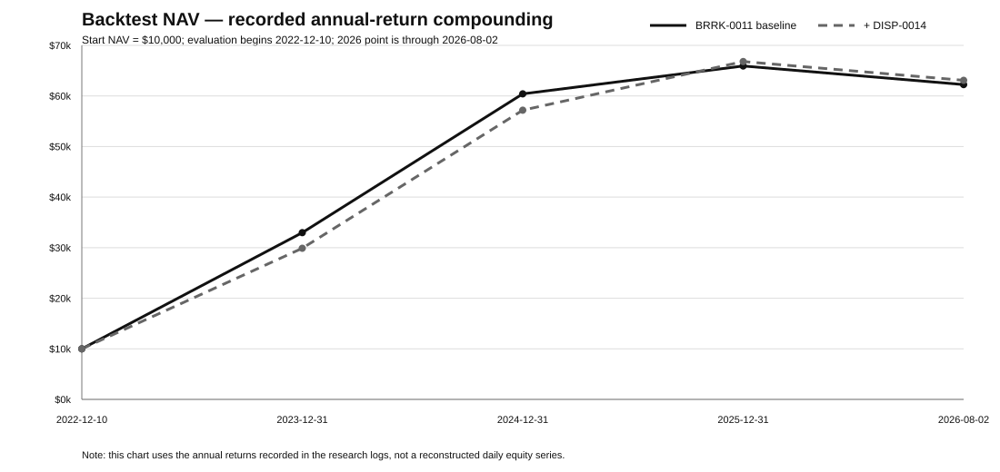

# laugh-to-2028

一个以 **长期生存、可审计和减少回测自欺** 为目标的 crypto systematic allocation research project。

当前主线不是继续堆指标，而是验证：**在 point-in-time、包含后来失败/退市资产的真实历史 universe 中，现有 regime / dispersion edge 是否仍然成立。**

## Current status

| Layer | Current status | Decision |
|---|---|---|
| BTC dynamic beta | Frozen core concept | 保留 |
| Fixed-universe V1 rotation | Historical alpha, selection-biased | 不直接外推 |
| **BRRK-0011** | **Frozen research baseline** | 当前基线 |
| DISP-0013 | High-NAV shadow candidate | 证据集中，降级 |
| **DISP-0014** | **Strongest shadow risk overlay** | 等待 PIT 验证 |
| **PIT-DISP-0015** | **Critical qualification test** | 尚无合法结果 |
| Historical funding-aware PnL | Not validated | HTTP 451 阻断 |
| Hyperliquid Plan B | Testnet / shadow implementation | 未 production-ready |

## Backtest PNL



> **图表说明**：旧 workflow 没有持久化精确日级 equity series，因此上图使用研究记录中的年度收益复利重建 year-end / period-end NAV，用于可视化 BRRK-0011 与 BRRK-0011 + DISP-0014 的路径差异。它不是伪造的日级曲线。PIT-DISP-0015 成功执行后，下一版必须直接持久化 daily equity CSV，并用真实日级 NAV 替换此图。

### 统一窗口核心指标

评估窗口：2022-12-10 至 2026-08-02；完成日线；t 日信号作用于 t+1；0.05 L1 rebalance band；5 bps / absolute weight change。

| Strategy | CAGR | MDD | Ann Vol | Sharpe | Calmar | Path CDaR95 | Upside capture | Downside capture |
|---|---:|---:|---:|---:|---:|---:|---:|---:|
| V1 | 61.255% | -37.635% | 44.454% | 1.295 | 1.628 | 36.550% | 106.05% | 80.33% |
| **BRRK-0011** | **65.104%** | **-33.715%** | 44.207% | **1.353** | **1.931** | **31.781%** | 105.02% | **72.99%** |
| BRRK-0011 + DISP-0014 | 65.709% | **-30.603%** | **39.010%** | **1.488** | **2.147** | **28.850%** | 98.45% | **62.40%** |

`DISP-0014` 的核心价值目前更像风险压缩，而不是额外 alpha：它明显降低 MDD、波动和 downside capture，但牺牲部分 upside capture。

## What we built

### 1. BTC Dynamic Beta

只使用完成 UTC 日线：20/60/120/240 日风险调整动量 + 30 日 realized volatility。

负趋势下 beta 防御性收缩到 0.18–0.65；正趋势从 1.0 向上扩张。人工“最后一跌反弹加仓”规则已经回测失败并淘汰。

### 2. V1 Rotation

第一版固定 BTC/ETH/SOL/BNB：BTC 决定 regime；risk-off 不配 alt；risk-on 时 alt 必须同时满足绝对趋势与相对 BTC 趋势，再选择 top 1–2。

历史结果很强，但 **SOL 是主要 alpha 来源**，并且 2024 后优势显著减弱。这直接暴露了固定今天赢家回测的 selection / survivorship 问题。

### 3. BRRK regime risk layer

早期 HMM 直接控制 exposure 时过度牺牲牛市收益。最终结构把 regime model 限定为 risk-budget authority：正常状态尽量不干预 V1，只在 Risk-Off 概率上升时赋予 de-risk 权限。

`BRRK-0011` 是修正 path CDaR 定义后的冻结基线：

- CAGR 65.10%
- MDD -33.72%
- Sharpe 1.353
- Calmar 1.931
- downside capture 72.99%

修正数学定义后结果几乎不变，因此 BRRK 优势不是旧 drawdown bug 造成。

### 4. Dispersion overlays

`DISP-0013`：极端横截面 dispersion 时 alt -> BTC。表面 CAGR 更高（约 67.5%），但 attribution 显示 97% 左右的正贡献集中于三个 episode，主要发生在 2024-11 下旬到 12 月初，因此证据等级下降。

`DISP-0014`：使用外部文献式 median-ratio scaling，高 dispersion 时整个组合 exposure -> cash。它对风险调整后指标改善更稳定，目前是最强 shadow risk overlay。

### 5. Point-in-time universe audits

我们枚举到 **661 个历史普通 Binance spot-USDT candidates**：

- 当前约 471 个仍为 `TRADING`；
- 189 个为 `BREAK`；
- 另有 1 个已不在 current exchangeInfo；
- 至少 185 个历史候选已在 2026-07 前结束。

历史 candidate pool 从 2020-08 的约 143 个扩张到 2026-07 的约 475 个，因此今天的 survivor 集合不能作为过去的 universe。

进一步验证：BREAK / 已从 exchangeInfo 消失的币仍能通过 Binance public market-data API 返回历史日线，因此可以构建真正 survivorship-aware panel。

## The critical next experiment: PIT-DISP-0015

规则已冻结：

```text
historical ordinary Binance USDT candidates
    ↓
240 consecutive completed daily rows
    ↓
completed-day quote volume >= $25m
    ↓
20d cumulative-log-return cross-sectional dispersion
    ↓
raw scale = clip(expanding_prior_median / dispersion, 0.10, 1.00)
    ↓
g_t = 0.80 * g_(t-1) + 0.20 * raw_scale
    ↓
scale frozen V1 exposure toward cash
```

后来 BREAK / inactive 的币在其真实存在期间必须保留。禁止看到结果后修改 $25m、240d、20d、0.10 或 0.80 参数。

**目前没有合法 0015 PnL。** 之前的 GitHub hosted runner 在 Python step 开始前即失败（0 steps / 0 logs / 0 artifacts），因此记录为 CI failure，不是模型 failure。

## Why survivorship is now P0

项目早期最漂亮的 rotation 数字很大程度上由 SOL 贡献。今天知道 SOL 成为大币，再回到 2021 把它放进固定候选池，会天然抬高历史表现。

因此现在最重要的问题不是“再找一个更聪明的信号”，而是：

> **当模型必须面对当时真实存在的资产、包括后来失败和退市的资产时，edge 还剩多少？**

只有这个问题通过，继续做 funding、covariance、LPM、leverage 才有意义。

## Funding status

曾尝试拉取 Binance USD-M historical funding 做正式 funding-aware backtest，但 GitHub runner 请求相关 endpoint 返回 HTTP 451。

因此：

- 当前没有合法 historical funding-aware PnL；
- funding filter 不能被描述为已经统计优化；
- 下一步应使用可访问 historical archive，分别核算 spot / perp / leverage overlay / hedge 的 carry 与成本。

## Execution architecture

当前执行层在 `execution/plan-b-bot/`：

```text
completed UTC daily candle
        ↓
BTC trend + rv30
        ↓
asymmetric beta target
        ↓
portfolio NAV / current exposure
        ↓
target perp quantity
        ↓
Hyperliquid testnet / shadow / trade skeleton
```

默认配置是 **testnet + shadow**。

已知仍需修复：dynamic size precision、reversal 后 fill reconciliation、partial-fill handling、order slicing、persistent idempotency/audit log、emergency reduce-only protection、endpoint hardening 和 mainnet safeguards。

## Next steps

优先级已经冻结：

1. **P0：跑通 PIT-DISP-0015**，并持久化 exact daily equity / weights / universe / dispersion scale。
2. **P1：构建 point-in-time dynamic alpha universe**，不再固定 ETH/SOL/BNB/XRP 等今天赢家。
3. **P2：补真实 historical funding + Spot/Perp Router**。
4. **P3：只有 universe validation 通过后**，再研究 covariance/risk contribution、LPM/downside-risk 等风险分配。
5. **P4：硬化 Hyperliquid execution**，完成 testnet end-to-end reconciliation。
6. **P5：最后才重新评估 leverage**；不因为历史 CAGR 漂亮就直接提高杠杆。

详细 gate 与 stopping rules：[`docs/NEXT_STEPS.md`](docs/NEXT_STEPS.md)

完整研究演化：[`docs/RESEARCH_HISTORY.md`](docs/RESEARCH_HISTORY.md)

迁移范围与旧库关系：[`docs/MIGRATION_MANIFEST.md`](docs/MIGRATION_MANIFEST.md)

## Repository layout

```text
.
├── README.md
├── docs/
│   ├── pnl.svg
│   ├── RESEARCH_HISTORY.md
│   ├── NEXT_STEPS.md
│   └── MIGRATION_MANIFEST.md
├── research/
│   ├── core/
│   ├── pit_universe/
│   └── results/
└── execution/
    └── plan-b-bot/
```

## Research discipline

- completed data only;
- no lookahead;
- transaction cost included where stated;
- preregister before material parameter experiments;
- rejected experiments remain rejected unless new independent evidence appears;
- do not pick sensitivity winners after seeing PnL;
- do not quote PIT-DISP-0015 or historical funding performance until valid runs exist;
- optimize for robustness and future validity, not maximum historical CAGR.

---

This repository is research software, not a representation that future returns will match backtests.
